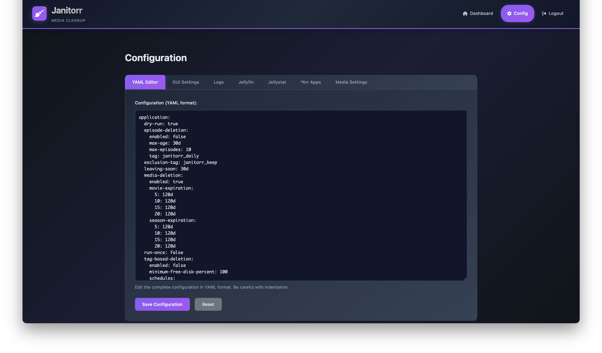

# Janitorr GUI

A simple Flask-based GUI for Janitorr to view scheduled media deletions and manage configuration.

## Features

- View scheduled media deletions from Janitorr in a user-friendly dashboard
- Edit Janitorr configuration directly from the web interface (YAML editor and tabbed forms)
- Comparison tool for changes done in config page
- LDAP and legacy authentication
- Auto-refresh dashboard for up-to-date status
- Light and dark theme support
- Made to work as a systemd service

## Requirements

- Python 3.8+
- Janitorr instance
- Access to Janitorr's config and log files

## Quick Start

1. Create a virtual environment and activate it:
    ```bash
    python3 -m venv venv
    source venv/bin/activate
    ```
2. Install dependencies:
    ```bash
    pip install -r requirements.txt
    ```
3. Copy `.env.example` to `.env` and edit as needed:
    ```bash
    cp .env.example .env
    ```
4. Run the app:
    ```bash
    flask run --port 5000
    ```

The app will be available at http://localhost:5000

> [!NOTE]
> An example systemd service is provided in [janitorr-gui.service](/contrib/janitorr-gui.service) file.

## Environment Variables

| Variable                  | Required | Default         | Description                                      |
|---------------------------|----------|-----------------|--------------------------------------------------|
| SECRET_KEY                | Yes      | dev | Flask session secret key                         |
| JANITORR_CONFIG_PATH      | Yes      | /var/www/janitorr/application.yml | Path to Janitorr's application.yml               |
| JANITORR_LOG_PATH         | Yes      | /var/log/janitorr/janitorr.log | Path to Janitorr's log file                      |
| JANITORR_WORKING_DIR      | No       | /var/www/janitorr   | Janitorr working directory                       |
| GUI_AUTO_REFRESH          | No       | 60              | Dashboard auto-refresh interval (seconds)         |
| GUI_THEME                 | No       | dark            | Dashboard theme (dark/light)                      |
| GUI_LEGACY_AUTH_ENABLED   | No       | false           | Enable legacy (username/password) auth            |
| GUI_LDAP_ENABLED          | No       | false           | Enable LDAP authentication                       |

**Note:** Only the variables marked "Yes" under Required are strictly necessary for the GUI to function. Others are optional and control features or appearance.

## Authentication

Enable authentication by setting the relevant variables in your `.env` file:

- `GUI_LEGACY_AUTH_ENABLED=true` enables username/password auth
- `GUI_LDAP_ENABLED=true` enables LDAP auth

## Deployment

For production, use a WSGI server (e.g., gunicorn) and a reverse proxy (e.g., nginx). Set environment variables in your systemd service or environment, or in `.env`.

## Project Structure

```
janitorr_gui/
├── app/
│   ├── __init__.py
│   ├── routes.py
│   ├── config.py
│   ├── jellyfin_client.py
│   ├── templates/
│   │   ├── base.html
│   │   ├── index.html
│   │   └── config.html
│   ├── static/
│   │   ├── css/
│   │   │   └── style.css
│   │   └── js/
│   │       └── main.js
│   └── utils/
│       ├── config_parser.py
│       └── log_parser.py
├── requirements.txt
└── run.py
```

## Screenshots

### Login Page

Login is available via LDAP or legacy authentication

### Dashboard

Sample entries are provided in the screenshot for demonstration purposes only

### Config Tabs

Configuration is possible via separate tabs or YAML editor right in the dashboard